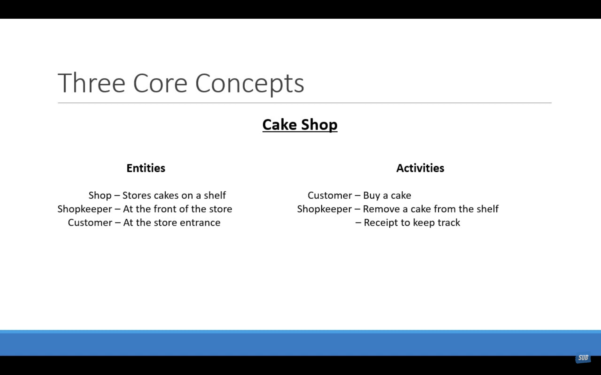
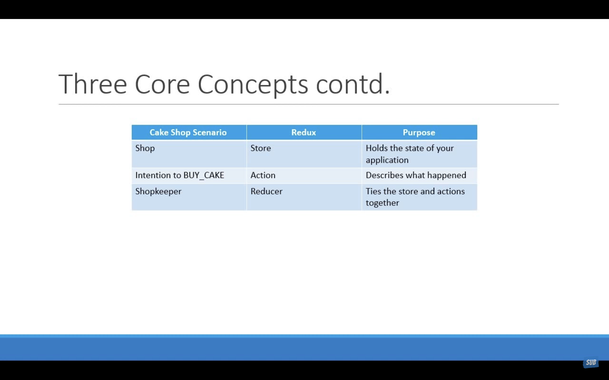

# Three Core Concepts of Redux
Before exploring three core concepts of redux, let's explore a live example of how Redux works in a cake shop scenario.

Imagine you have a cake shop with a few essential features below.

Let's compare the left and right parts of the scenario with the entities in a cake shop and how they relate to Redux concepts:
## Left Side - Entities of Cake Shop:
1. Shop:
- Redux Equivalent: Redux Store
- Explanation: The shop is like the Redux store, where all the state data (cakes inventory and orders) is centralized and managed.
  
2. Shopkeeper:
- Redux Equivalent: Reducers
- Explanation: The shopkeeper is like reducers in Redux. They handle actions (customer requests) by performing specific tasks (updating the state) based on the received action.

3. Customer:
- Redux Equivalent: Actions
- Explanation: Customers represent actions in Redux. They interact with the shop (store) by making requests (dispatching actions) such as adding a new cake to inventory or placing an order.

## Right Side - Actions and Reactions:
1. Customer Buying a Cake:
- Redux Equivalent: Dispatching an Action
- Explanation: When a customer decides to buy a cake, it's like dispatching an action in Redux. They initiate a change in the state of the shop (store) by requesting to buy a specific cake.

2. Shopkeeper Removing Cake from Shelf:
- Redux Equivalent: Reducer Updating State
- Explanation: The shopkeeper's action of removing a cake from the shelf corresponds to reducers updating the state in Redux. They respond to customer requests (actions) by updating the state (removing the cake from inventory).

3. Shopkeeper Providing Receipt:
- Redux Equivalent: Side Effects or Middleware
- Explanation: Providing a receipt to the customer can be likened to side effects or middleware in Redux. It's an additional action that occurs in response to a primary action (buying a cake) and doesn't directly affect the state but helps to keep track of events.

## In this comparison, we can see how the entities and actions in a cake shop scenario align with the core concepts of Redux.

# Now, it's time to know Three Core Concepts
## 1. Store : That holds the state of the application.
## 2. Action : That describes the changes in the state of the application.
## 3. Reducer : Which actually carries out the state transition depending on the action.

# [Next Conecpt](../Three_Principles/principle.md)
