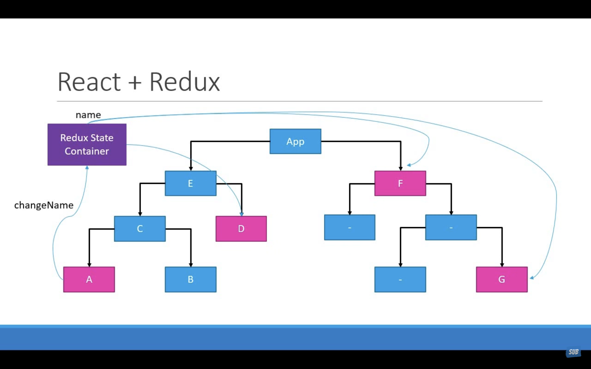

# Let's understand Redux 

# What is Redux ?
Redux is a predictable state management for Javascript Apps.

# Let's breakdown concepts
**1. Redux is for Javascript Apps :** Redux is used in javascript applications built with frameworks like React, Angular, or Vue. It's commonly employed in front-end web development but can also be used in other JavaScript environments such as React Native for mobile apps or Electron for desktop applications.
   
**2. Redux is State Management :** Redux operates based on a single centralized store, which holds the entire application state in a plain JavaScript object. This store is the single source of truth for the application's state.

**3. Redux is Predictable :** Redux provides a predictable pattern for managing application state. This predictability is crucial for maintaining the stability and reliability of complex JavaScript applications, especially as they scale in size and complexity.

# Let's understand React + Redux

By combining React for building UI components and Redux for managing application state, developers can create scalable, maintainable, and predictable JavaScript applications with a clear separation of concerns between UI components and application logic.

This combination is particularly well-suited for building large and complex applications where state management can become challenging.

   
